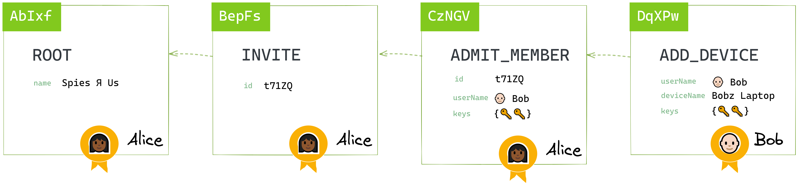

`@localfirst/auth` is a TypeScript library providing **decentralized authentication and
authorization** for team collaboration, using a secure chain of cryptographic signatures.

## Why

🤝 You're building a [local-first](http://inkandswitch.com/local-first.html) app to enable
distributed collaboration [without a central
server](http://medium.com/all-the-things/a-web-application-with-no-web-server-61000a6aed8f).

🔑 You want to **authenticate** users and manage their **permissions**.

🚫 You **don't** want to depend on a centralized authentication server or a key management service.

💙 You want to provide a **easy and seamless experience** to users creating and joining teams

🤔 You **don't** want to expose users to any of the underlying cryptographic complexity.

## How it works

This library uses a conflict-free replicated state container based on a **signature chain**
(provided by the [CRDX](https://github.com/herbcaudill/crdx) library) to manage team membership, permissions, and authentication.

All changes to the team's membership and permissions are recorded on the signature chain as a
sequence of **signed** and **hash-chained** actions.



Every team member keeps a complete replica of the signature chain and can validate other members'
actions independently. All **authorizations** can be traced back to the root action, created by the team's founding member. The chain
thereby builds a **tamper-proof, distributed web of trust**.

The team's signature chain also acts as a self-contained certificate authority or **public key
infrastructure** (PKI) solution. At any point in time we calculate the team's current state from it,
which includes each member's public keys, as well as their status and roles. This allows us to
provide **authenticated and encrypted peer-to-peer connections** between members.

**Invitations** are handled using a [Seitan token
exchange](https://book.keybase.io/docs/teams/seitan). Once admitted to the team, each member
generates their own cryptographic keys for signatures and encryption. They also generate
**device-level keys** that are stored in each devices' secure storage, and which never leave the
device.

When roles are changed, members leave, or devices are lost or replaced, keys are **rotated** and
associated data **re-encrypted**.

👉 Learn more: [Internals](./docs/internals.md)

## Demo

This repo includes a demo app. This will eventually simulate a simple group chat app, although the chat part hasn't been built yet; just the group membership parts.


To run the app, clone the repo and run

```bash
yarn dev
```

The app will be available at http://localhost:3000 .

This demo is also run by Cypress tests, which exercise most of the libary's functionality. To run these:

```
yarn dev:cy
```

## Usage

This library provides a `Team` class, which wraps the signature chain and encapsulates the team's
members, devices, and roles. With this object, you can **invite new members** and **manage their
permissions.**

This object can also use the public keys embedded in the signature chain, along with the user's own
secret keys, to provide **encryption** and **signature verification** within the team.

#### Not included

- **Storage** This library does **not** provide storage for user information (including keys) or the
  signature chain.
- **Networking** This library includes a protocol for synchronizing the team's signature chains, but
  you need to provide a working socket connecting us to a peer. (The demo uses [@localfirst/relay](https://github.com/local-first-web/relay), which is a tiny relay server and client that bridges two WebSocket connections to allow peers to talk directly to each other.)

### Examples

```bash
yarn add @localfirst/auth
```

#### Alice creates a new team

```js
import { user, team } from '@localfirst/auth'

// 👩🏾 Alice
const alice = user.create('alice')
const alicesTeam = team.create({ name: 'Spies Я Us', context: { user: alice } })
```

Usernames (`alice` in the example) identify a person uniquely within the team. You could use
existing user IDs or names, or email addresses.

#### Alice invites Bob

```js
// 👩🏾 Alice
const { secretKey } = alicesTeam.invite('bob')
```

The invitation key is a single-use secret that only Alice and Bob will ever know. By default, it is
a 16-character string like `aj7x d2jr 9c8f zrbs`, and to make it easier to retype if needed, it is
in base-30 format, which omits easily confused characters. It might be typed directly into your
application, or appended to a URL that Bob can click to accept:

> Alice has invited you to team XYZ. To accept, click: http://xyz.org/accept/aj7x+d2jr+9c8f+zrbs

Alice will send the invitation to Bob via a side channel she already trusts (phone call, email, SMS,
WhatsApp, Telegram, etc).

#### Bob accepts the invitation

Bob uses the secret invitation key to generate proof that he was invited, without divulging the key.

```js
// 👨🏻‍🦲 Bob
import { accept } from '@localfirst/auth'
const proofOfInvitation = accept('aj7x d2jr 9c8f zrbs')
```

When Bob shows up to join the team, anyone can validate his proof of invitation to admit him to the
team - it doesn't have to be an admin.

```js
// 👳🏽‍♂️ Charlie
team.admit(proofOfInvitation)
const success = team.has('bob') // TRUE
```

#### Alice defines a role and adds Bob

```js
// 👩🏾 Alice
team.addRole('managers')
team.addMemberRole('bob', 'managers')
```

#### Alice checks Bob's role membership

```js
// 👩🏾 Alice
const isAdmin = team.isAdmin('bob') // TRUE
```

#### Alice encrypts a message for managers

```js
// 👩🏾 Alice
const message = 'the condor flies at midnight'
const encrypted = team.encrypt(message, 'managers')
```

#### Bob decrypts the message

```js
// 👨🏻‍🦲 Bob
const decrypted = team.decrypt(encrypted) // 'the condor flies at midnight'
```

👉 Learn more: [API documentation](./docs/api.md).

## Prior art

💡 This project is inspired by and borrows heavily from Keybase: The signature chain is inspired by
[their implementation for Keybase Teams](https://keybase.io/docs/team), and the invitation mechanism
is based on their [Seitan token exchange specification](https://keybase.io/docs/teams/seitan_v2),
proposed as a more secure alternative to TOFU, or _**T**rust **O**n **F**irst **U**se_.

🌮 This library was originally called `taco-js`. TACO stands for _**T**rust **A**fter
**C**onfirmation **O**f invitation_.
