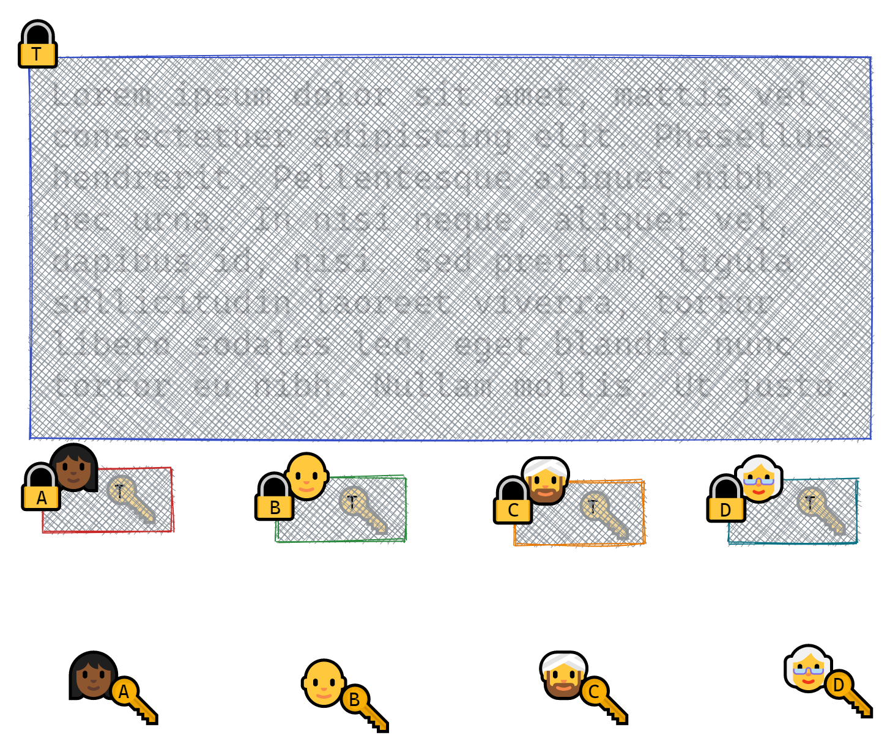
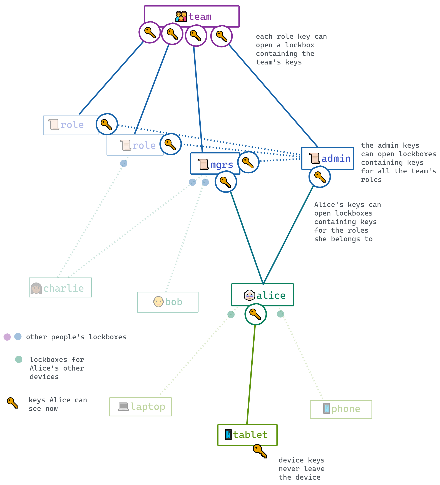
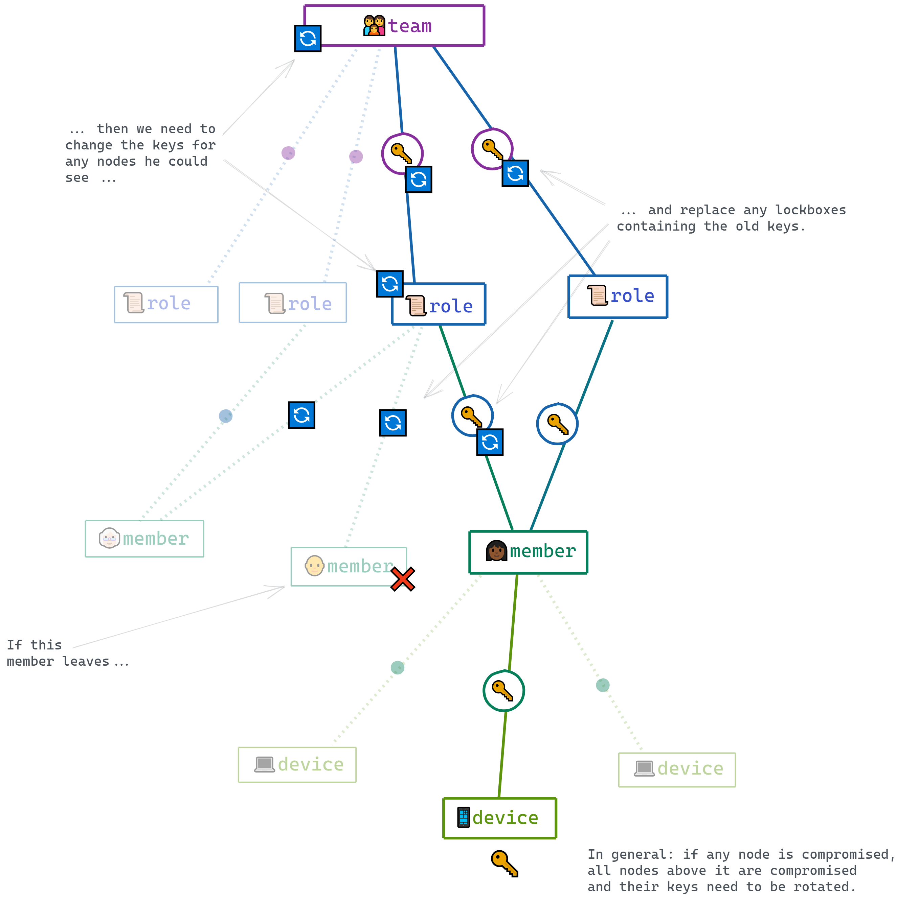

# Internals

## 👩🏾📱 Users, devices, and keys

TODO

## 📪⚛️ The CRDX store

###

TODO

### Action types

TODO

### The reducer

TODO

### The resolver

TODO

## 💌💌 Invitations

TODO

## 🔐📦 Lockboxes

A lockbox allows you to **encrypt content once for multiple readers**.



For example, you can **encrypt a dataset once for an entire team using a single secret key `T`**, and
**distribute one lockbox per team member containing the secret key**. In each lockbox, the secret key is encrypted
asymmetrically using an ephemeral private key and the member's public key.

To encrypt content using lockboxes, you only need to know the recipients' public keys. You don't need a trusted
side channel to communicate with the recipients, and you never have to transmit the secret in
cleartext. The lockboxes are clearly labeled and can be attached to the encrypted content for
storage, publication, or transmission.

A lockbox is just data: An encrypted payload, plus some metadata.

For example:

```js
const lockbox = {
  // need this to open the lockbox
  encryptionKey: {
    type: 'EPHEMERAL',
    publicKey: 'uwphz8qQaqNbfDx9JhvgOWt9hOgfNR3eZ0sgS1eFUP6QX25Q',
  },

  // information to identify the key that can open this lockbox
  recipient: {
    type: 'USER',
    name: 'alice',
    publicKey: 'x9nX0sBPlbUugyai9BR0A5vuZgMCekWodDpbtty9CrK7u8al',
  },

  // information about the contents of the lockbox
  contents: {
    type: 'ROLE',
    name: 'admin',
    publicKey: 'BmY3ZojiKMQavrPaGc3dp7N1E0nlw6ZtBvqAN4rOIXcWn9ej',
  },

  // the encrypted keyset
  encryptedPayload: 'BxAOzkrxpu2vwL+j98X9VDkcKqDoDQUNM2dJ9dXDsr...2wKeaT0T5wi0JVGh2lbW2VG5==',
}
```

The lockbox contents are encrypted using a single-use, randomly-generated key. The public half of this
ephemeral key is posted publicly on the lockbox; the secret half is used to encrypt the lockbox
contents, and is then discarded.

We use lockboxes to:

- share **team keys** with team **members**
- share **role keys** with **members** in that role
- share **all role keys** with the **admin role**
- share **user keys** with the user's **devices**

### The key graph

Keys provide access to other keys, via lockboxes; so we have an acyclic directed graph where keys are nodes and
lockboxes are edges.



Note that "acyclic" describes what honest peers produce, not what the format guarantees. Any member can post a lockbox holding a keyset they minted themselves, naming any scope and any generation, so the graph a peer replays is only as well-shaped as the links on it.

### Cycles

Nothing in a lockbox says which way the graph runs, so a member can post `create(k1, k2)` alongside `create(k2, k1)` and make the edges point at each other. Both walks over the key graph — `visibleKeys`, which opens lockboxes, and `visibleScopes`, which reads their manifests — carry a visited set for this reason. Aimed at one member's own scope, an unguarded walk took away both of the remediations the team has against that member: they could no longer be removed and no longer be re-keyed, by anybody, permanently.

### A member can displace a scope's keys

**This includes the team keys, and it takes one link from a member with no roles at all.** Lockbox manifests are plaintext, so the public key of every member's user keyset is on the graph. A member mints a keyset of their own, names it `TEAM`, and posts one lockbox per member addressed to those user keys — the same pairing `createTeam` and `admitMember` produce, so nothing at the door can refuse it. Every member who replays that link, admins included, then treats the forger's keyset as the team keys. They get no error. What they encrypt for the team, the forger can read and the rest of the team cannot.

The same works for a role, addressed to an admin's user keys. It propagates from there: `team.addMemberRole` puts the role keys *as the granting admin sees them* into a lockbox for the new member, so a displaced admin hands the forged keyset to members who never saw the forgery.

**Recovery: rotate the scope.** Rotating appends the replacement to the graph's own record of the keysets a scope has carried, and that record — not the `generation` number written inside a lockbox — is what decides which keyset is current. So the replacement takes over regardless of what the forgery claimed.

| what was displaced | what to run |
| --- | --- |
| the team keys | `team.remove(forger)` — removing any member rotates the team keys |
| a role's keys | `team.addMemberRole(someone, role)` then `team.removeMemberRole(someone, role)` |
| a member's own keys | `team.changeKeys(...)` for yourself, or an admin re-keys you |

**How you would notice.** This is the hard part, and there is no reliable alarm. The displaced member gets no error, and if everybody has been displaced they all agree with each other, so nothing local looks wrong. Two things are observable:

- **The generation isn't where your own history says it should be.** A scope's generation counts the keysets the graph has carried for it, so after each rotation you perform it should go up by exactly one. A jump, or a drop — a rotation taking it from 9 to 2 — means the graph carried keysets nobody on the team created.
- **Peers disagree.** Members who should share a scope's keys fail to decrypt each other's messages for it.

If you have reason to think a scope was forged over, rotate it; rotating a scope that was fine costs nothing but a round of re-encryption.

### The rule this is all an instance of

Six security fixes in this area turned out to be the same defect wearing different hats, because each one moved an authority off one attacker-writable quantity and onto another. The rule that would have caught all of them:

> **A lockbox manifest is a claim by its author about a key they have not proved they hold. Nothing outside `lockbox.open` may treat a manifest field as an assertion about a member.**

A manifest is plaintext and anyone can post a lockbox, so `contents.name`, `recipient.name`, `contents.publicKey`, `recipient.publicKey` and `contents.generation` are all things somebody wrote down, not things the team established. `lockbox.open` is the one place that turns a claim into a fact, because it is the only place where holding the key is what decides.

An earlier version of this rule was stated about *generations* only. It was applied faithfully and closed that class, and then three more holes turned up that were the same defect in fields that aren't generations — a key claimed as a member's, a name claimed as a holder's, and a position claimed by being first.

Two mechanical checks, and it matters that neither alone is enough:

- `grep -rn '\.contents\.\|\.recipient\.' packages/auth/src` outside `lockbox/open.ts` finds everything that reads a manifest directly.
- That grep **does not** find code that consumes manifest-derived data *after* `open` has handed it on as a keyset — `keyMap` files by the keyset's own `type`/`name`/`generation`, and `getDeviceUserFromGraph` picks by `generation`, and neither contains the string. Both were sites of real holes. So the second check is: anything deciding *which* keyset, member, or holder something is about must name the graph-assigned quantity it uses to decide.
- The second check needs a candidate list of its own, or it depends on somebody thinking to look. Exactly four functions hand manifest-derived data onward — `visibleKeys`, `keyMap`, `select.keys` and `select.keyring` — so **enumerate their callers and apply the rule to each**. `grep -rn 'visibleKeys\|keyMap\|select\.keys\|select\.keyring' packages/auth/src` is the list. That turns the rule from a test you have to remember to apply into a search.

**An ordering is not one of them.** "First on the graph", "the earliest lockbox naming this key", "whichever arrived before the other" all read as graph-assigned and are not:

> If an anchor is an ordering, a count of position, or a first/last-one-wins rule, it is **not** graph-assigned in the sense this rule needs — because `prev` is a field the link's author writes. Graph-assigned means *written by the reducer, from an action that cleared the validators*. Position and arrival order are settled by the resolver, and the resolver's input includes an attacker-chosen `prev`.

That is not hypothetical here, and it bit twice. An ear anchored to "the earliest lockbox naming this invitation's signature key" was defeated by an author who read the key off the public invitation link and wrote their own ear on a head from before the invitation existed. Moving the ear's identity into reducer-written state fixed the *value* and left the *selection among values* an ordering — `Object.values(state.invitations).find(...)` is insertion order — until an invitation's public key was required to be unique, which makes the lookup answer one thing. **Moving a quantity into reducer-written state is not enough on its own; whatever selects among those values has to be unambiguous too.** See `auth-6bw` for the backdating primitive itself.

Note this is not a convergence problem: for a fixed graph the resolver is deterministic, so honest peers agree. The variance you see re-running such an attack is the attacker's odds of grinding a favourable placement, not peers disagreeing.

Two rules in this codebase are still ordering-shaped, and a maintainer changing either should know they are standing on sequence order rather than on state:

- `selectors/keys` resolves the current generation as the last entry in `keyHistory` that the device holds. An earlier version of this page said backdating could only place a keyset *earlier* in that list and so could not make it current. **That is false** — measured, one attempt in four put a backdated forgery last, after the honest rotation. `Team.rotateKeys` uses the list's *length*, which is a count and not an ordering, and is not affected.
- **`keyMap`'s first-wins tie rule is what actually holds that line, and it is load-bearing.** The same earlier version called it "no longer load-bearing", which was also false. A minted keyset claiming generation 0 can reach the end of `keyHistory`, and the only reason it does not become current is that generation 0 is a slot the device already filled, so first-wins keeps the keyset it had. Constructed directly and measured both ways: with first-wins the current keyset is the honest one, without it the forgery. There is now a test for exactly that.

Both of those corrections are the same shape as a check that was deleted from `checkPayload` on a redundancy argument and had to be restored: **a right conclusion resting on a wrong reason will retire the thing that is doing the work.** When a rule here is described as safe, the description has to name what makes it safe, and that has to be the thing a test fails without.

### And a lockbox is a grant, so both halves have to agree

The two statements above are both about **identity** — *which* keyset, member or holder is this about — and both are phrased about one field's provenance. That leaves a whole class untouched, because a lockbox is a grant and a grant has two halves:

> **A lockbox hands a scope to a holder, and both halves have to agree. Anchoring the holder is not enough: for each (contents scope, recipient) pairing, name the relation that entitles that holder to that scope, and check it BY NAME rather than by type. A holder the team knows is not thereby entitled to every scope.**

Nothing here needs a forgery. The attacker uses their own genuine, registered device or user keys as the recipient — every identity check passes, because nothing about them is false — and the only lie is which scope the contents name. A door rule that checked the contents *type* and not the *name* passed it while its own error message stated the invariant it wasn't enforcing.

Enumerate the pairings honest code produces, and write down the relation each carries:

| contents | recipient | relation that entitles the holder |
| --- | --- | --- |
| TEAM | USER | any member |
| TEAM | SERVER | any server (a server never has roles) |
| ROLE r | USER | a member who is **in role r** |
| ROLE r | ROLE | the recipient role is **admin** |
| USER u | DEVICE | **u's own** device |
| USER u | EPHEMERAL | **u's own** invitation |
| USER | USER | not an honest pairing — refused |

`selectors/lockboxesInScope` checks that table, and refuses anything not in it. Four of those rows were holes when the table was first written down, and two of the four had been flagged as "candidates, unmeasured" — both turned out to be real, which is the argument for enumerating the whole table rather than fixing the rows somebody happened to notice.

### And a grant is standing, not a past event

The three statements above all evaluate a lockbox as if the moment it was posted is the only moment that matters. None of them asks whether the grant is still live:

> **A lockbox is a standing grant, not a past event. Every rotation re-honours it, so each of the conditions that made it legitimate has to still hold at that moment — not merely have held when it was posted. For anything with a lifecycle — revoked, expired, used up, superseded — the check belongs where the grant is honoured, not only where it is redeemed.**

An invitation ear was anchored to an invitation that exists, selected unambiguously, and entitled to exactly its own member's scope — all three earlier statements satisfied — and nothing consulted `revoked`, `expiration` or `maxUses`. An invitation seed is a bearer token handed over a side channel, and revocation exists *because seeds leak*; revoking one stopped it being used to join and did nothing about the keys, so whoever held it went on receiving every future rotation of the inviting member's own keys, permanently. Expiry and exhaustion were the same. `invitationCanBeUsed` is now called in both places — where an invitation is redeemed, and where its grant is honoured.

Two things measured rather than assumed while writing this down:

- **Role membership is re-read per rotation**, so it is clean by construction: removing a member from a role drops them from that role's rotation set on the next rotation (`USER recipients before 2, after removing one 1`).
- **The two "any member / any server" rows in the pairing table are stronger than that label.** The identity lookups read `state.members` and `state.servers`, which exclude removed members and servers, and a discarded admission never reaches `state.members` at all — so "any member" is really "any *current* member", enforced by the identity half rather than by a separate rule.

**The inverse risk is real and is the thing to measure when adding a check here.** An entitlement omission silently loses keys; a lifecycle check silently cuts off an honest holder mid-flow. The rule that keeps both in view: fail closed on what is distributed *next*, and leave anything already delivered intact. Measured — a joiner partway through a live invitation still comes up on the current keys across a rotation, and revoking removes what comes next while the lockbox already handed over still opens.

### The observable that decides whether a reproduction means anything

This has been wrong three times in this work, and each time it turned a real hole into a clean-looking result or the reverse:

> Do not ask **"can the attacker reach something that names the victim's scope"** — a decoy the attacker planted names it too, and they can of course open their own decoy. Ask whether they hold the victim's **actual current secret**, by comparing against it.

The same applies to "did this rotation do anything": compare the keyset before and after, rather than asking whether some lockbox exists.

The quantities the graph assigns, rather than an author: `state.keyHistory` (a scope's keysets, in the order the graph carried them), `state.registeredKeys` (the keys the team registered for each member, written only by actions that cleared their own rules), and the member, device and server records themselves.

| site | what it decides | status |
| --- | --- | --- |
| `selectors/keys` | which generation of a scope is current | **satisfies** — `keyHistory` order |
| `Team.rotateKeys` | the generation a rotation writes | **satisfies** — `keyHistory.length` |
| `Team.updateUserKeys` | when to adopt new keys for ourselves | **satisfies** — `select.keys`, and only a key the team registered for us |
| `registeredEncryptionKeys` | which keys belong to a member — what every authorship rule rests on | **satisfies** — from keysets the team registered, never from a manifest |
| `transforms/removeDevice` | promotes a manifest into a member's registered keyset | **gated** — `canOnlyRemoveYourOwnDevices` confines it to the author's own record |
| `selectors/visibleKeys` | which lockboxes I can open | **satisfies** — matches `recipient.publicKey` against a key actually held |
| `validate` `rolesWithKeys` | which roles a grant hands to a member | **gated** — narrows by `recipient.name` but decides on `recipient.publicKey` through the registered-key record, and role grants are admin-only |
| `transforms/removeRole`, `removeMemberRole` | which lockboxes to prune | **audited** — prunes by manifest name, but what protects the role is the rotation that accompanies it, not the pruning |
| `selectors/keyring` | which generations of a member's keys a device may use | **satisfies** — for a scope that is somebody, only keysets the team registered for them |
| `selectors/visibleScopes` | which scopes a rotation should cover | **measured** — a manifest can add scopes to a rotation and nothing else. 2,000 decoy lockboxes give 2,001 visible scopes and a removal still succeeds, linearly. "Can only add" holds here, for cost as well as correctness — but it was only recorded as safe once it had been measured, because the same words were false for the two rows below |
| `selectors/lockboxesInScope` | who gets a replacement when a scope rotates | **satisfies** — every recipient kind is anchored to something the graph carries. Members, servers and devices to the team's record of them; a ROLE to the role existing and the manifest carrying that role's current keyset from `keyHistory`; an EPHEMERAL ear to the ear the reducer recorded on the link that posted the invitation (`postInvitation`), looked up by a key that is unique because `invitationsCanOnlyBePostedOnce` now requires it, and only for the scope of the member that invitation names; plus a door rule confining an ear to USER keys whatever else is true of it |
| `selectors/keyMap` | which keyset wins for a scope and generation | **unchanged, and no longer load-bearing** — first-wins still decides ties, but `selectors/keys` no longer treats a keyset the graph never carried as current, and an admission can no longer introduce one |
| `connection/getDeviceUserFromGraph` | which user keys a joining device adopts | **satisfies** — the keyring it picks from now holds only keysets the team registered for that member (`selectors/keyring`) |

Any new selector reading the lockbox graph, or reading a keyset that came out of one, should be checked against the rule above and added to this table.

## API

#### `lockbox.create(contents, recipientKeys)`

To make a lockbox, pass in two keysets:

- `contents`, the secret keys to be encrypted in the lockbox. This has to be a `KeysetWithSecrets`.
- `recipientKeys`, the public keys used to open the lockbox. At minimum, this needs to include the recipient's public encryption key (plus metadata for scope and generation).

This makes a lockbox for Alice containing the admin keys.

```js
import * as lockbox from 'lockbox'

const adminLockboxForAlice = lockbox.create(adminKeys, alice.keys)
```

This illustrates the minimum information needed to create a lockbox:

```js
const adminLockboxForAlice = lockbox.create(
  {
    type: 'ROLE',
    name: 'admin',
    generation: 0,
    signature: {
      publicKey: 'B3B8xMFdLDLbd72tXLlgxyvsAJravbATqMtTtje1PQdikGjN=',
      privateKey: 'QI4vBzCKvn6SBvyR7PBKFuuKiSGk3naX0oetx3XUtPK...AX1W0LCdWwMlHhNO3T5jVwnkz=',
    },
    encryption: {
      publicKey: 'asuM3NexDiDs2P2OKQOu3tdXWz2zV6LoaxPfZPLIb8gFIIU0=',
      privateKey: 'e1tcEjpGfKuJz8JObrVJGqq9zrXpNwyHafYEd298p3MyYThJ=',
    },
  },
  {
    type: 'USER',
    name: 'alice',
    generation: 0,
    publicKey: 'JG81tVDDfp3BqXedrtiRiWtvqQKt2175nAceYIPjjMR7z2Y1',
  }
)
```

#### `lockbox.open(lockbox, decryptionKeys)`

To open a lockbox:

```js
const adminKeys = open(adminLockboxForAlice, alice.keys)
```

#### `lockbox.rotate(oldLockbox, contents)`

"Rotating" a lockbox means replacing the keys it contains with new ones.

When a member leaves a team or a role, or a device is lost, we say the corresponding keyset is
'compromised' and we need to replace it -- along with any keys that it provided access to.

For example, if the admin keys are compromised, we'll need to come up with a new set of keys; then
we'll need to find every lockbox that contained the old keys, and replace them with the new ones.

```js
const newAdminKeys = createKeyset({ type: ROLE, name: ADMIN })
const newAdminLockboxForAlice = lockbox.rotate(adminLockboxForAlice, newAdminKeys)
```

We'll also need to so the same for any keys _in lockboxes that the those keys opened_.



This logic is implemented in the private `rotateKeys` method in the `Team` class.

## `Team`

TODO

## `Connection`

TODO
