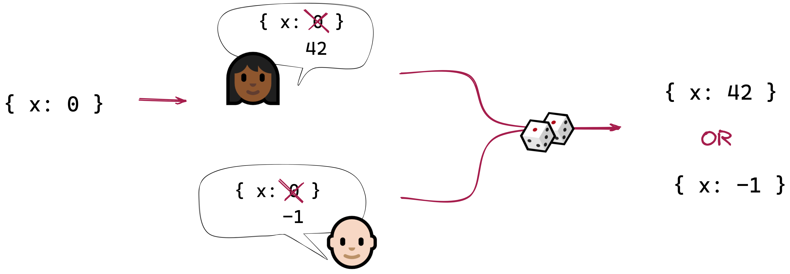

## An encrypted conflict-free replicated state container

**CRDX** is a **state container for JavaScript apps**. It's comparable to
[Redux](https://redux.js.org/), [MobX](https://mobx.js.org/README.html), or
[Recoil](https://recoiljs.org/), and it can be used with any framework ([React](https://reactjs.org/),
[Vue](https://vuejs.org/), [Svelte](https://svelte.dev/), etc.), or with no framework.

It is also an operation-based **CRDT** ([conflict-free replicated
datatype](https://en.wikipedia.org/wiki/Conflict-free_replicated_data_type)), allowing you to create
a [local-first](http://inkandswitch.com/local-first/) application that syncs state directly with
peers, with no need for a authoritative central server. This library includes a network-agnostic
**sync protocol** that receives and generates messages to be sent over whatever communication
channel you choose.

Each operation in the CRDT is signed and encrypted. This opens up the possibility of building
collaborative local-first apps with end-to-end encryption, secure authentication, and enforceable
read/write permissions.

## Why

We already have excellent JavaScript CRDT libaries such as
[Automerge](https://github.com/automerge/automerge) and [Yjs](https://github.com/yjs/yjs). So what
does this project bring to the table?

This library started life as the internal data store for
[@localfirst/auth](https://github.com/local-first-web/auth), which is a library I've been working on
for local-first authentication and authorization. Decentralized group management is a [tricky
problem](https://eprint.iacr.org/2020/1281.pdf); I couldn't use an off-the-shelf JSON CRDT, because
"conflict" in this context means something more subtle. Before I knew it, I realized that I'd built
a custom CRDT for managing group membership. It occurred to me that the same mechanism could be used
to build other custom CRDTs; so I extracted the inner workings into this stand-alone library.

### Custom conflict detection and resolution

A CRDT uses mechanical conflict-resolution rules to guarantee that **concurrent changes can always
be merged** _without_ human intervention — and _without_ a centralized server. Think Git, but
without the need to manually resolve merge conflicts; or operational transforms (OT), but without
the need for an authoritative server. CRDTs are exciting because they open up possibilities for
decentralized, peer-to-peer collaboration.

Automerge and Yjs define a conflict as _two peers assigning different values to the same property_,
and they resolve conflicts by choosing one of the two values as the "winner", in an **arbitrary but
predictable** way (for example, by comparing the hashes of the two operations).



This simple solution is good enough for a surprising number of applications, and if it works for
you, you should probably consider using Automerge or Yjs instead of this library.

But what a conflict involves more than one property? Or what if you have your own rules for
resolving conflicts? For example:

| Example&nbsp;domain                              | Domain-specific conflict                                                           | A possible rule for conflict resolution                                      |
| ------------------------------------------------ | ---------------------------------------------------------------------------------- | ---------------------------------------------------------------------------- |
| **Group chat**                                   | Alice removes Bob from a group; concurrently, Bob removes Alice                    | To be safe, both Alice and Bob are removed                                   |
| **Scheduling meeting rooms**                     | Alice books a room from 2:00 to 4:00; concurrently, Bob books it from 3:00 to 5:00 | Alice gets the room because she is senior to Bob                             |
| **[Spit](https://cardgames.io/spit/) card game** | Alice and Bob concurrently try to play on top of the same card                     | We compare hashes to arbitrarily-but-predictably decide whose card is on top |

**Detecting conflicts** may be more subtle than just noticing when two users concurrently modify a
property. And **resolving conflicts** may involve requirements that won't let us just resolve
conflicts in an arbitrary way. CRDX lets you provide a **resolver** to examine concurrent changes
and decide what to do with them.

### A familiar programming model

If you’ve used a state container like Redux before, there’s a lot about CRDX that will be very
familiar. There’s a `createStore` function that initializes a store for your application state. Just
like a Redux store, you can **dispatch** named **actions** to it, and query it for its current
**state**. You provide a **reducer** function to calculate your current state from any sequence of
actions.

Redux works with an append-only list of actions. CRDX adds a couple of twists:

- To support peer-to-peer replication, we need to deal with concurrent changes, which means a simple
  append-only list of actions won’t be sufficient. Instead, we arrange actions in a **directed acyclic
  graph** (DAG).
- To ensure the integrity of the whole sequence of actions, each one is linked to the previous one
  by its cryptographic **hash**.
- To ensure each action’s authenticity, each one is **signed and encrypted** by its author.

## How

```bash
yarn add crdx
```

Here is how you might use CRDX to implement a simple counter:

```js
import { createUser, createChain, createStore } from '@localfirst/crdx'

const alice = createUser('alice')
const keys = createKeys()

const counterReducer = (state, link) => {
  const action = link.body
  switch (action.type) {
    case 'ROOT': {
      return { value: 0 }
    }

    case 'INCREMENT': {
      return {
        ...state,
        value: state.value + 1,
      }
    }

    default:
      return state
  }
}

const store = createStore({
  user: alice,
  reducer: counterReducer,
  keys,
})

store.dispatch({ type: 'INCREMENT' })
store.dispatch({ type: 'INCREMENT' })

const state = store.getState()
console.log(state.value) // 2
```

Notice that the reducer function is very much like a Redux reducer: It takes an existing state
object and a link (which looks just like a Redux action, with a type and possibly a payload), and it
returns a new state object.

#### The hash graph

A hash graph is an acyclic directed graph of links, each one describing an action. Each link is
**signed and encrypted** by its author, and includes the **hashes of the (encrypted) parent links**.

This means that the chain is **append-only**: Existing nodes can’t be modified, reordered, or
removed without causing multiple checks to fail.


A hash graph is just data and can be stored as JSON. It consists of a hash table of the encrypted
links, plus a pointer to the **root** (the “founding” link added when the chain was created) and the
**head(s)** (the most recent link(s) we know about). When stored, an encrypted graph might look like
this:

```json
{
  "head": ["GXBWd"], // hashes truncated for legibility
  "root": "4Sap2",
  "encryptedLinks": {
    "4Sap2": {
      "senderPublicKey": "5t2H9", // the "sender" is the author of this link
      "recipientPublicKey": "7QviM", // the "recipient" is the
      "encryptedBody": "3cYojt4cPMoHpc4..."
    },
    "BczbE": {
      "senderPublicKey": "5t2H9",
      "recipientPublicKey": "7QviM",
      "encryptedBody": "9WpyqyBNRzr8eNG..."
    },
    "GXBWd": {
      "senderPublicKey": "5t2H9",
      "recipientPublicKey": "7QviM",
      "encryptedBody": "9WpyqYtSmSfnLEp..."
    }
  },
  // this is a map of dependencies
  "childMap": { "4Sap2": ["BczbE"], "BczbE": ["GXBWd"] }
}
```

If Alice adds new links to the hash graph while Bob is disconnected, there’s no problem: When they
sync up, Alice will see that Bob is behind and send him the latest links in the chain.

If Alice and Bob _both_ add new links to the hash graph while they’re disconnected from each other,
when they sync up, the new links from both of them will be added to the graph. The graph will now
have at least two heads, and a new link would reference them both as parents.

> TODO update image - there's no `merge` link


The links describe **actions**. A decrypted link might look like this:

```json
{
  "hash": "BczbE",
  "body": {
    "type": "INCREMENT",
    "userId": "clfgy1",
    "timestamp": 1679323838712,
    "prev": ["4Sap2"]
  }
}
```

#### Users and keys

In order to sign actions dispatched to the store, CRDX needs to know the name and keys of the local
user. CRDX provides the `createUser` function to generate a user object with a new (randomly
generated) keyset in the correct format:

```js
const alice = createUser('alice')
```

The resulting object might look like this:

```json
{
  "userId": "clfgydp6d0002l0onbtbrf24m",
  "userName": "alice",
  "keys": {
    "type": "USER",
    "name": "clfgydp6d0002l0onbtbrf24m",
    "generation": 0,
    "signature": { "publicKey": "598En...", "secretKey": "FXBZS..." },
    "encryption": { "publicKey": "9hZJi...", "secretKey": "AVgZM..." },
    "secretKey": "7FjrJ..."
  }
}
```

You'll also need a set of shared keys for the graph. These keys would be shared with all authorized users.

```js
const keys = createKeyset({ type: 'GRAPH' })
```

```json
{
  "type": "GRAPH",
  "name": "GRAPH",
  "generation": 0,
  "signature": { "publicKey": "GQrmB...", "secretKey": "P7AgG..." },
  "encryption": { "publicKey": "7QviM...", "secretKey": "HiFFK..." },
  "secretKey": "GUg4d..."
}
```

You’ll need to store this information securely once it’s been generated.

CRDX doesn’t keep track of any other users’ names or public keys — you’ll need to ensure that Alice
has some way of knowing Bob’s public keys and vice versa.

> If you don't already have a way to manage users' secret keys and verify their public keys, you
> might be interested in [@localfirst/auth](https://github.com/local-first-web/auth). This library
> uses CRDX internally to manage group membership and permissions, and keeps track of each member’s
> public keys on the hash graph itself. It supports multiple devices per user, each with their own
> keys that never leave the device; and it handles key rotation in case members leave the group, a
> device is compromised, etc.

#### The resolver function

Like Redux, CRDX uses a **reducer** to calculate the current state from a sequence of actions. But
we’re working with a directed graph, not a sequence. To flatten the hash graph’s graph of
actions into a single sequence, you provide a **resolver** function that defines how any two
concurrent sequences will be merged. This is where you implement any domain-specific
conflict-resolution logic.

Suppose you have the following graph. Actions **c** and **d** are made concurrently.

> TODO: update image (no merge link)


Your resolver will decide what to do with these concurrent actions: How they're ordered, and which ones to keep. It might

- take **c** before **d**
- take **d** before **c**
- take **d** and discard **c** altogether
- etc.

A resolver is a function that takes the graph as an argument and returns two functions: A **sort**
function, and a **filter** function. Depending on the use case, you might define one or the other,
or both.

Here's a simple resolver that uses seniority to determine the order of concurrent actions. This
resolver only returns a `sort` function.

```ts
/** the person with the longest tenure wins in the case of conflicts */
const resolver: Resolver<SchedulerAction, SchedulerState> = graph => {
  const seniorityLookup: Record<string, number> = {
    alice: 10, // years
    bob: 3,
    charlie: 7,
  }

  const seniority = (link: SchedulerLink) => seniorityLookup[link.body.userId]
  return {
    sort: (a: SchedulerLink, b: SchedulerLink) => seniority(b) - seniority(a),
  }
}
```

Here's an example of a resolver that implements more complex logic, using both a `filter` function
and a `sort` function:

```ts
/**
 * Custom logic:
 * 1. if `e` and `f` are concurrent, `e` is invalid
 * 2. if `h` and `i` are concurrent, both are invalid
 * 3. `j` comes first, otherwise sort alphabetically
 */
const resolver: Resolver<XAction, any> = graph => {
  const invalid: Record<Hash, boolean> = {}
  for (const link of Object.values(graph.links)) {
    const concurrentLinks = getConcurrentLinks(graph, link)
    for (const concurrentLink of concurrentLinks) {
      // rule 1
      if (link.body.payload === 'f' && concurrentLink.body.payload === 'e') {
        invalid[concurrentLink.hash] = true
      }
      // rule 2
      if (link.body.payload === 'h' && concurrentLink.body.payload === 'i') {
        invalid[link.hash] = true
        invalid[concurrentLink.hash] = true
      }
    }
  }
  return {
    sort: (_a, _b) => {
      const a = _a.body.payload
      const b = _b.body.payload

      // rule 3
      if (a === 'j') return -1
      if (b === 'j') return 1

      if (a < b) return -1
      if (a > b) return 1
      return 0
    },
    filter: link => {
      return !invalid[link.hash]
    },
  }
}
```
