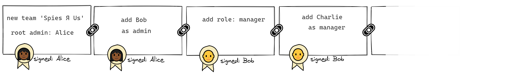

## ✍🔗 Signature chain

A signature chain is an acyclic directed graph of links. Each link

- is **cryptographically signed** by the author; and
- includes a **hash of the parent link**.



A signature chain is just data and can be stored as JSON. For example, here's a signature chain containing two links:

```jsonc
[
  // root link
  {
    "body": {
      "type": 0,
      "payload": { "team": "Spies Я Us" },
      "user": "alice",
      "device": { "id": "PKN4tM7BtW8=", "name": "windows laptop", "type": 1 },
      "client": { "name": "test", "version": "0" },
      "timestamp": 1588421926221,
      "prev": null,
      "index": 0
    },
    "signed": {
      "name": "alice",
      "signature": "oTKyn8iTwrrAdH...CuhPEkqNaGRKYBW64RL3NJlnwMoIg+6NiYrhh2RBg==",
      "key": "/I7WZRWBGTAJD30JJRq+CVOLWL7iGxIHlbBmq80bjLg="
    }
  },
  // another link
  {
    "body": {
      "type": "something",
      "payload": {},
      "user": "alice",
      "device": { "id": "PKN4tM7BtW8=", "name": "windows laptop", "type": 1 },
      "client": { "name": "test", "version": "0" },
      "timestamp": 1588421926268,
      "prev": "fog76617S9wsklpT...gMe/rGZicPZFEItOKNNbgiB3JbGU2P1VKWERIVnyvcmQ==",
      "index": 1
    },
    "signed": {
      "name": "alice",
      "signature": "OM3MZ0lHL9Pdpex4WO9IDcii...D8bUnxFiKXJ3ECpfRgpedBCmB9CW3Cw==",
      "key": "/I7WZRWBGTAJD30JJRq+CVOLWL7iGxIHlbBmq80bjLg="
    }
  }
]
```

The `chain` module doesn't know anything about teams or access rules. It just creates chains, appends to them, and checks them for internal validity.

### Link structure

```js
export interface LinkBody {
  type: string
  payload: any
  context: Context
  timestamp: UnixTimestamp
  expires?: UnixTimestamp
  prev: Base64 | null
  index: number
}
```

#### User-provided fields

- `type` is a label for the type of action that this link represents - for example, `ADD_MEMBER` or `REMOVE`. (This is conceptually similar to a Redux action type.) The `team` module defines the valid types.

- `payload` is the content of the action - for example, it might contain the name and public keys of a member being added. (Likewise, this is analogous to the payload of a Redux action.)

- `context` contains information about the environment in which the link was created - who authored it, on what device, using what software. For example:

  ```js
  context: {
    user: 'alice',
    device: {
      id: 'dell-123',
      name: 'windows laptop',
      type: 'laptop'
    },
    client: {
      name: 'test',
      version: '0'
    }
  }
  ```

#### Generated fields

- `timestamp` contains the Unix timestamp of the creation of the link.

- `prev` contains the hash of the previous link (or `null` in the case of the root link).

- `index` contains the zero-based sequential index of the link. The root link has index `0`, the next link has index `1`, and so on.

### Helper functions

#### `create(payload, context)`

Returns a signature chain containing a single root element.

```js
const payload = { team: 'Spies Я Us' }
const chain = create(payload, context)
```

#### `append(chain, link, context)`

Takes a chain, a partial link (containing just a `type` and a `payload`), and a context; and returns a new chain with the link filled out, signed, and populated with the hash of the preceding link.

```js
const newChain = append(
  chain,
  { type: 'ADD_USER', payload: { name: 'bob', keys: {...} } },
  context
)
```

#### `validate(chain)`

Runs a chain through a set of validators that ensure that each link

- matches its **signature**,
- has a **hash** matching the previous link, and
- has an **index** that is consecutive to the previous link.

Returns an object with two properties:

- **`isValid`** is true or false
- if `isValid` is false, **`error`** is an object containing
  - `message` describing the first error found, an
  - `index` the index of the link containing the error
  - `details` any additional specifics about the error

For example, suppose Eve tampers with the root link's payload to change the name of the team from "Spies Я Us" to "Dorks Я Us". Validation will show that the signature of the link no longer matches the body of the link:

```js
const result = validate(chain)

// {
//   isValid: false
//   error: {
//     message: 'Signature is not valid',
//     index: 0,
//     details: {
//       payload: {
//         type: 'ROOT',
//         payload: { team: 'Dorks Я Us' },
//         context: { ... },
//         timestamp: 1588506524404,
//         prev: null,
//         index: 0
//       },
//       signature: '0eUheuxOU1F1puoTsQzGzcVCbC...ah3vBBKbQzkGFJ7V9+9DFAg==',
//       publicKey: '6xPEKryp82mUOl7OvT2NGdBm1iGWE3KsOwml20nAht8='
//     }
//   }
// }
```
