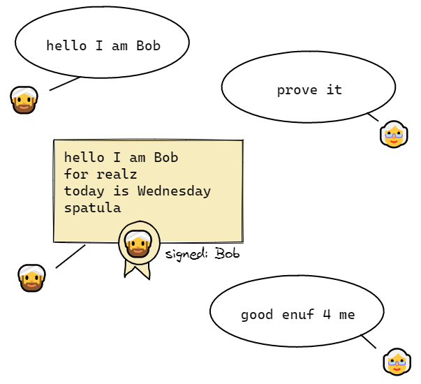

TODO this is out of date

### Initial handshake

#### Both are existing members in good standing

| Alice     | Bob       |
| --------- | --------- |
| CLAIM     | CLAIM     |
| CHALLENGE | CHALLENGE |
| PROVE     | PROVE     |
| VERIFY    | VERIFY    |

#### Bob has been invited

| Alice           | Bob         |
| --------------- | ----------- |
| CLAIM           | SHOW_INVITE |
| VALIDATE_INVITE |             |
|                 | CLAIM       |
| CHALLENGE       | CHALLENGE   |
| PROVE           | PROVE       |
| VERIFY          | VERIFY      |

Q : How does Bob know he's talking to a team member?  
A : He validates his own invitation after getting in

# Identity & authentication

Someone shows up, saying they're Bob. Without a trusted third party in the form of a centralized
server to vouch that this is indeed Bob, how can Alice be sure that she's not talking to an
impostor?

The answer is a cryptographic **signature challenge**. It kind of works like this:



Specifically, here's how our signature challenge protocol works:

- **Claim**: Bob claims that he is the team member with the username `bob` by means of this message:

  ```js
  {
    type: 'CLAIM_IDENTITY',
    payload: {
      type: 'MEMBER',
      name: 'bob'
    }
  }
  ```

- **Challenge**: Alice gives Bob a document to sign. The document contains Bob's original claim,
  plus a timestamp and a random nonce. These last two ensure that each challenge is unique, so that
  if Eve intercepts Bob's signed proof of identity, she can't reuse it to claim to be Bob.

  ```js
  {
    type: 'CHALLENGE_IDENTITY',
    payload: {
      type: 'MEMBER',
      name: 'bob',
      nonce: 'ueQhdcS9Ky3nNzWLnAcg25PAW9KqMXbOhbzfUM46G8lFpV8A',
      timestamp: 1591785804793
    }
  }
  ```

- **Proof**: Using his signature secret key, Bob signs the challenge document, and returns it to
  Alice along with the signature.

  ```js
  {
    type: 'PROVE_IDENTITY',
    payload: {
      challenge: {
        type: 'MEMBER',
        name: 'bob',
        nonce: 'ueQhdcS9Ky3nNzWLnAcg25PAW9KqMXbOhbzfUM46G8lFpV8A',
        timestamp: 1591785804793,
      },
      signature: 'UmCLHmSRT+4qUfl1W1t/hXsPaSdPoVXuANWdcDz52bJzO...UEdN9bZ=='
    }
  }
  ```

- **Verification**: Alice checks the signature against the challenge document she sent and against
  Bob's public signature key, which is recorded in the team's signature chain. Depending on the
  outcome of her check, she either sends an acceptance or rejection message.

  ```js
  {
    type: 'ACCEPT_IDENTITY' // or 'REJECT_IDENTITY'
  }
  ```

Here's a complete example from the test suite, showing how Eve cannot reuse an intercepted proof.

```js
const bobSecretKeys = bob.keys
const bobPublicKeys = keyset.redactKeys(bob.keys)

// 👨🏻‍🦲 Bob shows up and says he's Bob
const bobsClaim: KeyScope = { type: MEMBER, name: 'bob' }

// 👩🏾 Alice asks maybe-Bob to prove it by sending him a document to sign
const alicesChallengeToBob = challenge(bobsClaim)

// 👨🏻‍🦲 Bob submits proof
const bobsProof = prove(alicesChallengeToBob, bobSecretKeys)

// 👩🏾 Alice checks his proof
const validationOfBobsProof = verify(alicesChallengeToBob, bobsProof, bobPublicKeys)

// ✅ Bob's proof checks out
expect(validationOfBobsProof).toBeValid()

// 👀 BUT! Eve intercepted Bob's proof, so she tries to re-use it

// 🦹‍♀️ Eve shows up and says she's Bob
const evesClaimToBeBob: KeyScope = { type: MEMBER, name: 'bob' }

// 👩🏾 Alice checks asks maybe-Bob to prove it by sending him a document to sign
const alicesChallengeToEve = challenge(evesClaimToBeBob)

// 🦹‍♀️ Eve submits the proof she intercepted from Bob
const evesProof = bobsProof

// 👩🏾 Alice checks Eve's proof
const validationOfEvesProof = verify(alicesChallengeToEve, evesProof, bobPublicKeys)

// ❌ FOILED AGAIN!! Eve's proof fails because the challenge she was given is different
expect(validationOfEvesProof).not.toBeValid()
```

### Confirming team & role membership

Sometimes you don't care who exactly you're dealing with, as long as you can confirm that they're a
team member, say, or an admin. You can use the same process, replacing the `MEMBER` scope with a
`TEAM` or `ROLE` scope. For example:

```js
{
  type: 'CLAIM_IDENTITY',
  payload: {
    type: 'ROLE',
    name: 'admin'
  }
}
```
