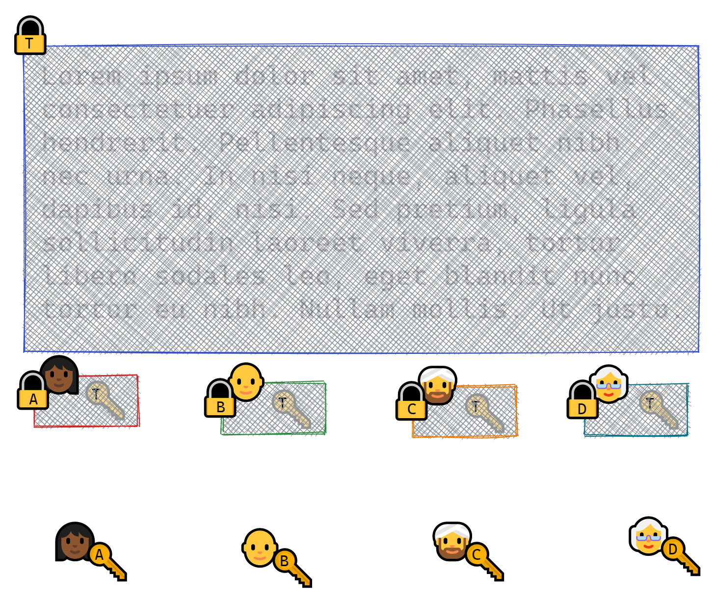
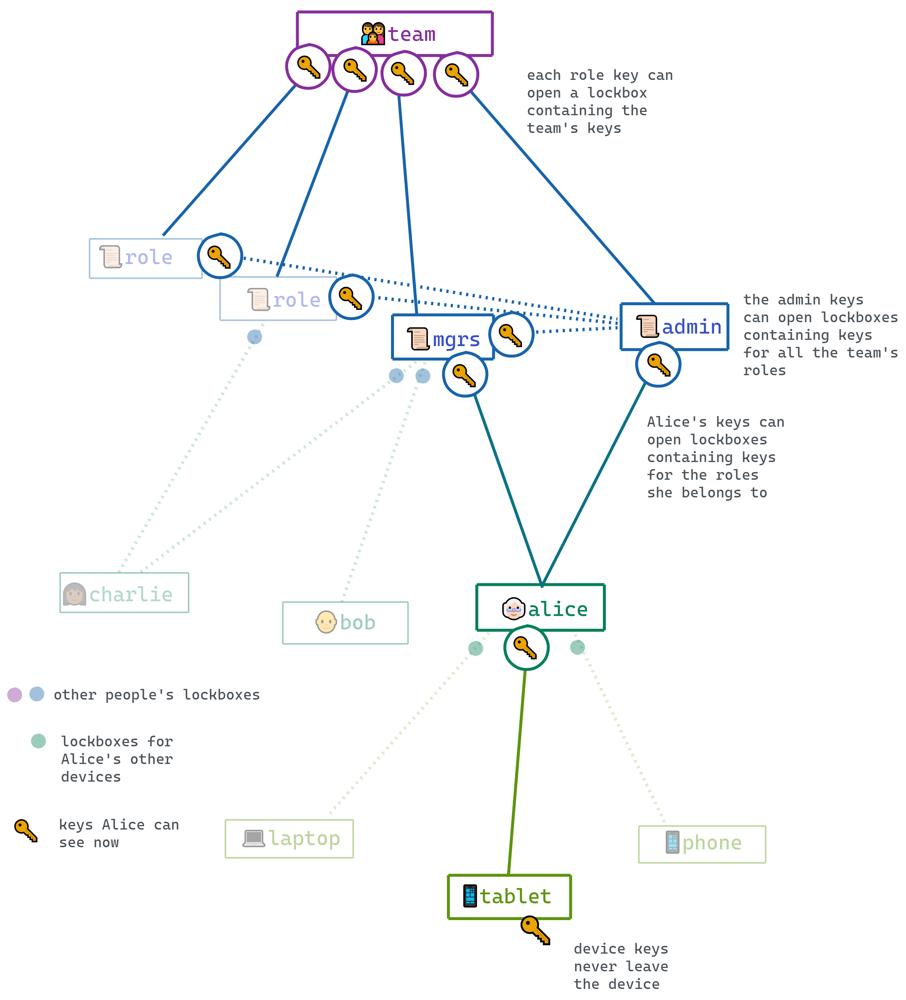

## 🔐📦 Lockbox

A lockbox allows you to **encrypt content once for multiple readers**.



For example, you can **encrypt a dataset once for an entire team using a single secret key `T`**, and
**distribute one lockbox per team member containing the secret key**. In each lockbox, the secret key is encrypted
asymmetrically using an ephemeral private key and the member's public key.

To encrypt content using lockboxes, you only need to know the recipients' public keys. You don't need a trusted
side channel to communicate with the recipients, and you never have to transmit the secret in
cleartext. The lockboxes are clearly labeled and can be attached to the encrypted content for
storage, publication, or transmission.

A lockbox is just data: An encrypted payload, plus some metadata.

For example:

```js
const lockbox = {
  // need this to open the lockbox
  encryptionKey: {
    type: 'EPHEMERAL',
    publicKey: 'uwphz8qQaqNbfDx9JhvgOWt9hOgfNR3eZ0sgS1eFUP6QX25Q',
  },

  // information to identify the key that can open this lockbox
  recipient: {
    type: 'USER',
    name: 'alice',
    publicKey: 'x9nX0sBPlbUugyai9BR0A5vuZgMCekWodDpbtty9CrK7u8al',
  },

  // information about the contents of the lockbox
  contents: {
    type: 'ROLE',
    name: 'admin',
    publicKey: 'BmY3ZojiKMQavrPaGc3dp7N1E0nlw6ZtBvqAN4rOIXcWn9ej',
  },

  // the encrypted keyset
  encryptedPayload: 'BxAOzkrxpu2vwL+j98X9VDkcKqDoDQUNM2dJ9dXDsr...2wKeaT0T5wi0JVGh2lbW2VG5==',
}
```

The lockbox contents are encrypted using a single-use, randomly-generated key. The public half of this
ephemeral key is posted publicly on the lockbox; the secret half is used to encrypt the lockbox
contents, and is then discarded.

We use lockboxes to:

- share **team keys** with team **members**
- share **role keys** with **members** in that role
- share **all role keys** with the **admin role**
- share **user keys** with the user's **devices**

### The key graph

Keys provide access to other keys, via lockboxes; so we have an acyclic directed graph where keys are nodes and
lockboxes are edges.



## API

#### `lockbox.create(contents, recipientKeys)`

To make a lockbox, pass in two keysets:

- `contents`, the secret keys to be encrypted in the lockbox. This has to be a `KeysetWithSecrets`.
- `recipientKeys`, the public keys used to open the lockbox. At minimum, this needs to include the recipient's public encryption key (plus metadata for scope and generation).

This makes a lockbox for Alice containing the admin keys.

```js
import * as lockbox from '/lockbox'
const adminLockboxForAlice = lockbox.create(adminKeys, alice.keys)
```

This illustrates the minimum information needed to create a lockbox:

```js
const adminLockboxForAlice = lockbox.create(
  {
    type: 'ROLE',
    name: 'admin',
    generation: 0,
    signature: {
      publicKey: 'B3B8xMFdLDLbd72tXLlgxyvsAJravbATqMtTtje1PQdikGjN=',
      privateKey: 'QI4vBzCKvn6SBvyR7PBKFuuKiSGk3naX0oetx3XUtPK...AX1W0LCdWwMlHhNO3T5jVwnkz=',
    },
    encryption: {
      publicKey: 'asuM3NexDiDs2P2OKQOu3tdXWz2zV6LoaxPfZPLIb8gFIIU0=',
      privateKey: 'e1tcEjpGfKuJz8JObrVJGqq9zrXpNwyHafYEd298p3MyYThJ=',
    },
  },
  {
    type: 'USER',
    name: 'alice',
    generation: 0,
    publicKey: 'JG81tVDDfp3BqXedrtiRiWtvqQKt2175nAceYIPjjMR7z2Y1',
  }
)
```

#### `lockbox.open(lockbox, decryptionKeys)`

To open a lockbox:

```js
const adminKeys = open(adminLockboxForAlice, alice.keys)
```

#### `lockbox.rotate(oldLockbox, contents)`

"Rotating" a lockbox means replacing the keys it contains with new ones.

When a member leaves a team or a role, or a device is lost, we say the corresponding keyset is
'compromised' and we need to replace it -- along with any keys that it provided access to.

For example, if the admin keys are compromised, we'll need to come up with a new set of keys; then
we'll need to find every lockbox that contained the old keys, and replace them with the new ones.

```js
const newAdminKeys = keyset.create({ type: ROLE, name: ADMIN })
const newAdminLockboxForAlice = lockbox.rotate(adminLockboxForAlice, newAdminKeys)
```

We'll also need to so the same for any keys _in lockboxes that the those keys opened_. 


This is
logic implemented in the private `rotateKeys` method in the `Team` class.